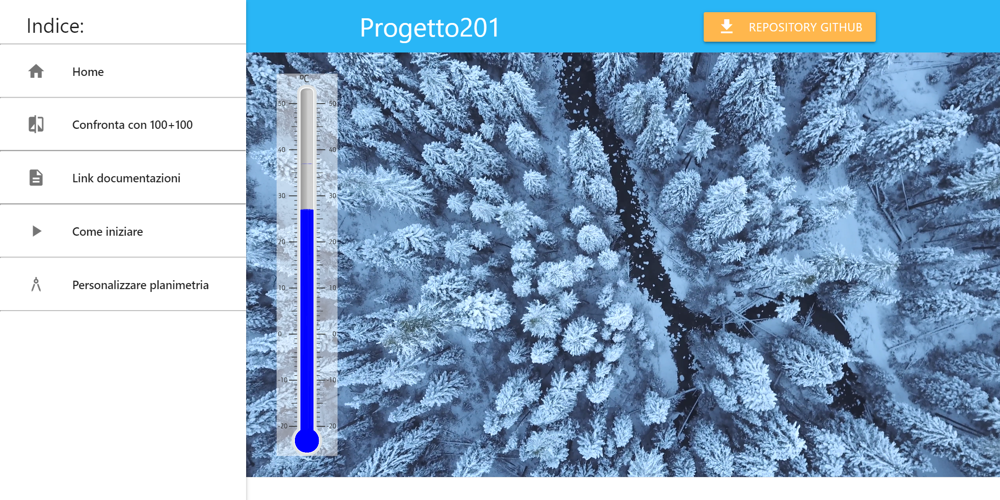

# PROGETTO201-WIKI

Questa e' la wiki del progetto201.

Link: [progetto201.github.io](https://progetto201.github.io/)

Controllo automatico dello spelling: 



## Introduzione
La wiki e' generata da [Jekyll](https://jekyllrb.com/), 
un generatore di siti web statici.

## Descrizione
Il sito e' strutturato nelle seguenti cartelle:

    _docs
Contiene i file per questo README e non viene
incluso nella generazione del sito web.

    _includes
Contiene tutti i file che possono essere inclusi con la direttiva liquid ``````.
> Attualmente sono inclusi solo file html, e questi file sono nella sottocartella ```html```

    _layouts
Contiene i layout, gli scheletri delle pagine web, utilizzabili per generare
la pagina finita.

    _sass
Contiene file Sass (in questo caso sono file CSS con l'estensione scss)
che possono essere importati dalla direttiva Sass ```@import <file>;```.

    _site
Contiene il sito web generato. La cartella non e' inclusa nel repository perche' github-pages usa automaticamente jekyll per generare il sito.

    assets
Contiene tutti i file CSS, immagini, JavaScript, SVG e video
che vengono utilizzati sul sito web.
> La cartella non inizia con "_", questo significa che durante la generazione
> il suo contenuto viene copiato nella cartella ```_site/assets```

I file invece sono:

    _config.yml
File YAML di configurazione di jekyll, contiene il nome del sito, la lingua,
eventuali plugin (nessuno in questo caso), il percorso dei post 
(jekyll e' nato per generare blog, questo sito non contiene post),
descrizione del sito e specifica di comprimere i file Sass per ottimizzarli.

    .gitignore
File di git che indica quali file e cartelle ignorare

    404.html
Pagina visualizzata quando l'utente finisce in una pagina non trovata.

    difference.html
Pagina che visualizza le differenze tra il progetto 100+100 e progetto 201

    docs.html
Pagina che contiene i link alle documentazioni dei componenti del progetto 201

    favicon.ico
Icona del sito, appare sulla tab del browser.

    floorplan.html
Pagina che spiega come personalizzare la planimetria nel progetto 201.

    Gemfile
    Gemfile.lock
File di Rubygem, specificano le dipendenze di jekyll
> Gemfile.lock impedisce modifiche accidentali

    index.html
Pagina principale della wiki del progetto 201.

    README.md
Stai leggendo questo file.

    start.html
Pagina della wiki del progetto 201 che spiega come iniziare ad utilizzare il progetto
elencando procedure e istruzioni.

## Requisiti
* jekyll
* ruby

## Changelog
**01_01 2020-08-10:** <br>
Primo commit

## Autore
Zenaro Stefano
